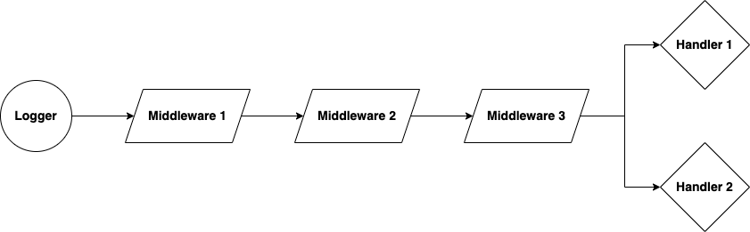

# slog: Handler chaining, fanout, routing, failover, load balancing...

[](https://github.com/samber/slog-multi/releases)

[](https://pkg.go.dev/github.com/samber/slog-multi)

[](https://goreportcard.com/report/github.com/samber/slog-multi)
[](https://codecov.io/gh/samber/slog-multi)
[](https://github.com/samber/slog-multi/graphs/contributors)
[](./LICENSE)

Design workflows of [slog](https://pkg.go.dev/log/slog) handlers:
- **fanout**: distribute `log.Record` to multiple `slog.Handler` in parallel
- **pipeline**: rewrite `log.Record` on the fly (eg: for privacy reason)
- **routing**: forward `log.Record` to all matching `slog.Handler`
- **failover**: forward `log.Record` to the first available `slog.Handler`
- **load balancing**: increase log bandwidth by sending `log.Record` to a pool of `slog.Handler`

Here a simple workflow with both pipeline and fanout:



**See also:**

- [slog-multi](https://github.com/samber/slog-multi): `slog.Handler` chaining, fanout, routing, failover, load balancing...
- [slog-formatter](https://github.com/samber/slog-formatter): `slog` attribute formatting
- [slog-sampling](https://github.com/samber/slog-sampling): `slog` sampling policy
- [slog-gin](https://github.com/samber/slog-gin): Gin middleware for `slog` logger
- [slog-echo](https://github.com/samber/slog-echo): Echo middleware for `slog` logger
- [slog-fiber](https://github.com/samber/slog-fiber): Fiber middleware for `slog` logger
- [slog-datadog](https://github.com/samber/slog-datadog): A `slog` handler for `Datadog`
- [slog-rollbar](https://github.com/samber/slog-rollbar): A `slog` handler for `Rollbar`
- [slog-sentry](https://github.com/samber/slog-sentry): A `slog` handler for `Sentry`
- [slog-syslog](https://github.com/samber/slog-syslog): A `slog` handler for `Syslog`
- [slog-logstash](https://github.com/samber/slog-logstash): A `slog` handler for `Logstash`
- [slog-fluentd](https://github.com/samber/slog-fluentd): A `slog` handler for `Fluentd`
- [slog-graylog](https://github.com/samber/slog-graylog): A `slog` handler for `Graylog`
- [slog-loki](https://github.com/samber/slog-loki): A `slog` handler for `Loki`
- [slog-slack](https://github.com/samber/slog-slack): A `slog` handler for `Slack`
- [slog-telegram](https://github.com/samber/slog-telegram): A `slog` handler for `Telegram`
- [slog-mattermost](https://github.com/samber/slog-mattermost): A `slog` handler for `Mattermost`
- [slog-microsoft-teams](https://github.com/samber/slog-microsoft-teams): A `slog` handler for `Microsoft Teams`
- [slog-webhook](https://github.com/samber/slog-webhook): A `slog` handler for `Webhook`
- [slog-kafka](https://github.com/samber/slog-kafka): A `slog` handler for `Kafka`
- [slog-parquet](https://github.com/samber/slog-parquet): A `slog` handler for `Parquet` + `Object Storage`

## 🚀 Install

```sh
go get github.com/samber/slog-multi
```

**Compatibility**: go >= 1.21

No breaking changes will be made to exported APIs before v2.0.0.

⚠️ Use this library carefully, log processing can be very costly (!)

## 💡 Usage

GoDoc: [https://pkg.go.dev/github.com/samber/slog-multi](https://pkg.go.dev/github.com/samber/slog-multi)

### Broadcast: `slogmulti.Fanout()`

Distribute logs to multiple `slog.Handler` in parallel.

```go
import (
    slogmulti "github.com/samber/slog-multi"
    "log/slog"
)

func main() {
    logstash, _ := net.Dial("tcp", "logstash.acme:4242")    // use github.com/netbrain/goautosocket for auto-reconnect
    stderr := os.Stderr

    logger := slog.New(
        slogmulti.Fanout(
            slog.NewJSONHandler(logstash, &slog.HandlerOptions{}),  // pass to first handler: logstash over tcp
            slog.NewTextHandler(stderr, &slog.HandlerOptions{}),    // then to second handler: stderr
            // ...
        ),
    )

    logger.
        With(
            slog.Group("user",
                slog.String("id", "user-123"),
                slog.Time("created_at", time.Now()),
            ),
        ).
        With("environment", "dev").
        With("error", fmt.Errorf("an error")).
        Error("A message")
}
```

Stderr output:

```
time=2023-04-10T14:00:0.000000+00:00 level=ERROR msg="A message" user.id=user-123 user.created_at=2023-04-10T14:00:0.000000+00:00 environment=dev error="an error"
```

Netcat output:

```json
{
	"time":"2023-04-10T14:00:0.000000+00:00",
	"level":"ERROR",
	"msg":"A message",
	"user":{
		"id":"user-123",
		"created_at":"2023-04-10T14:00:0.000000+00:00"
	},
	"environment":"dev",
	"error":"an error"
}
```

### Routing: `slogmulti.Router()`

Distribute logs to all matching `slog.Handler` in parallel.

```go
import (
    slogmulti "github.com/samber/slog-multi"
	slogslack "github.com/samber/slog-slack"
    "log/slog"
)

func main() {
    slackChannelUS := slogslack.Option{Level: slog.LevelError, WebhookURL: "xxx", Channel: "supervision-us"}.NewSlackHandler()
	slackChannelEU := slogslack.Option{Level: slog.LevelError, WebhookURL: "xxx", Channel: "supervision-eu"}.NewSlackHandler()
	slackChannelAPAC := slogslack.Option{Level: slog.LevelError, WebhookURL: "xxx", Channel: "supervision-apac"}.NewSlackHandler()

	logger := slog.New(
		slogmulti.Router().
			Add(slackChannelUS, recordMatchRegion("us")).
			Add(slackChannelEU, recordMatchRegion("eu")).
			Add(slackChannelAPAC, recordMatchRegion("apac")).
			Handler(),
	)

	logger.
		With("region", "us").
		With("pool", "us-east-1").
		Error("Server desynchronized")
}

func recordMatchRegion(region string) func(ctx context.Context, r slog.Record) bool {
	return func(ctx context.Context, r slog.Record) bool {
		ok := false

		r.Attrs(func(attr slog.Attr) bool {
			if attr.Key == "region" && attr.Value.Kind() == slog.KindString && attr.Value.String() == region {
				ok = true
				return false
			}

			return true
		})

		return ok
	}
}
```

### Failover: `slogmulti.Failover()`

List multiple targets for a `slog.Record` instead of retrying on the same unavailable log management system.

```go
import (
	"net"
    slogmulti "github.com/samber/slog-multi"
    "log/slog"
)


func main() {
	// ncat -l 1000 -k
	// ncat -l 1001 -k
	// ncat -l 1002 -k

    // list AZs
    // use github.com/netbrain/goautosocket for auto-reconnect
	logstash1, _ := net.Dial("tcp", "logstash.eu-west-3a.internal:1000")
	logstash2, _ := net.Dial("tcp", "logstash.eu-west-3b.internal:1000")
	logstash3, _ := net.Dial("tcp", "logstash.eu-west-3c.internal:1000")

	logger := slog.New(
		slogmulti.Failover()(
			slog.HandlerOptions{}.NewJSONHandler(logstash1),    // send to this instance first
			slog.HandlerOptions{}.NewJSONHandler(logstash2),    // then this instance in case of failure
			slog.HandlerOptions{}.NewJSONHandler(logstash3),    // and finally this instance in case of double failure
		),
	)

	logger.
		With(
			slog.Group("user",
				slog.String("id", "user-123"),
				slog.Time("created_at", time.Now()),
			),
		).
		With("environment", "dev").
		With("error", fmt.Errorf("an error")).
		Error("A message")
}
```

### Load balancing: `slogmulti.Pool()`

Increase log bandwidth by sending `log.Record` to a pool of `slog.Handler`.

```go
import (
	"net"
    slogmulti "github.com/samber/slog-multi"
    "log/slog"
)

func main() {
	// ncat -l 1000 -k
	// ncat -l 1001 -k
	// ncat -l 1002 -k

    // list AZs
    // use github.com/netbrain/goautosocket for auto-reconnect
	logstash1, _ := net.Dial("tcp", "logstash.eu-west-3a.internal:1000")
	logstash2, _ := net.Dial("tcp", "logstash.eu-west-3b.internal:1000")
	logstash3, _ := net.Dial("tcp", "logstash.eu-west-3c.internal:1000")

	logger := slog.New(
		slogmulti.Pool()(
            // a random handler will be picked
			slog.HandlerOptions{}.NewJSONHandler(logstash1),
			slog.HandlerOptions{}.NewJSONHandler(logstash2),
			slog.HandlerOptions{}.NewJSONHandler(logstash3),
		),
	)

	logger.
		With(
			slog.Group("user",
				slog.String("id", "user-123"),
				slog.Time("created_at", time.Now()),
			),
		).
		With("environment", "dev").
		With("error", fmt.Errorf("an error")).
		Error("A message")
}
```

### Chaining: `slogmulti.Pipe()`

Rewrite `log.Record` on the fly (eg: for privacy reason).

```go
func main() {
    // first middleware: format go `error` type into an object {error: "*myCustomErrorType", message: "could not reach https://a.b/c"}
    errorFormattingMiddleware := slogmulti.NewHandleInlineMiddleware(errorFormattingMiddleware)

    // second middleware: remove PII
    gdprMiddleware := NewGDPRMiddleware()

    // final handler
    sink := slog.NewJSONHandler(os.Stderr, &slog.HandlerOptions{})

    logger := slog.New(
        slogmulti.
            Pipe(errorFormattingMiddleware).
            Pipe(gdprMiddleware).
            // ...
            Handler(sink),
    )

    logger.
        With(
            slog.Group("user",
                slog.String("id", "user-123"),
                slog.String("email", "user-123"),
                slog.Time("created_at", time.Now()),
            ),
        ).
        With("environment", "dev").
        Error("A message",
            slog.String("foo", "bar"),
            slog.Any("error", fmt.Errorf("an error")),
        )
}
```

Stderr output:

```json
{
    "time":"2023-04-10T14:00:0.000000+00:00",
    "level":"ERROR",
    "msg":"A message",
    "user":{
        "id":"*******",
        "email":"*******",
        "created_at":"*******"
    },
    "environment":"dev",
    "foo":"bar",
    "error":{
        "type":"*myCustomErrorType",
        "message":"an error"
    }
}
```

#### Custom middleware

Middleware must match the following prototype:

```go
type Middleware func(slog.Handler) slog.Handler
```

The example above uses:
- a custom middleware, [see here](./examples/pipe/gdpr.go)
- an inline middleware, [see here](./examples/pipe/errors.go)

Note: `WithAttrs` and `WithGroup` methods of custom middleware must return a new instance, instead of `this`.

#### Inline middleware

An "inline middleware" (aka. lambda), is a shortcut to middleware implementation, that hooks a single method and proxies others.

```go
// hook `logger.Enabled` method
mdw := slogmulti.NewEnabledInlineMiddleware(func(ctx context.Context, level slog.Level, next func(context.Context, slog.Level) bool) bool{
    // [...]
    return next(ctx, level)
})
```

```go
// hook `logger.Handle` method
mdw := slogmulti.NewHandleInlineMiddleware(func(ctx context.Context, record slog.Record, next func(context.Context, slog.Record) error) error {
    // [...]
    return next(ctx, record)
})
```

```go
// hook `logger.WithAttrs` method
mdw := slogmulti.NewWithAttrsInlineMiddleware(func(attrs []slog.Attr, next func([]slog.Attr) slog.Handler) slog.Handler{
    // [...]
    return next(attrs)
})
```

```go
// hook `logger.WithGroup` method
mdw := slogmulti.NewWithGroupInlineMiddleware(func(name string, next func(string) slog.Handler) slog.Handler{
    // [...]
    return next(name)
})
```

A super inline middleware that hooks all methods.

> Warning: you would rather implement your own middleware.

```go
mdw := slogmulti.NewInlineMiddleware(
    func(ctx context.Context, level slog.Level, next func(context.Context, slog.Level) bool) bool{
        // [...]
        return next(ctx, level)
    },
    func(ctx context.Context, record slog.Record, next func(context.Context, slog.Record) error) error{
        // [...]
        return next(ctx, record)
    },
    func(attrs []slog.Attr, next func([]slog.Attr) slog.Handler) slog.Handler{
        // [...]
        return next(attrs)
    },
    func(name string, next func(string) slog.Handler) slog.Handler{
        // [...]
        return next(name)
    },
)
```

## 🤝 Contributing

- Ping me on twitter [@samuelberthe](https://twitter.com/samuelberthe) (DMs, mentions, whatever :))
- Fork the [project](https://github.com/samber/slog-multi)
- Fix [open issues](https://github.com/samber/slog-multi/issues) or request new features

Don't hesitate ;)

```bash
# Install some dev dependencies
make tools

# Run tests
make test
# or
make watch-test
```

## 👤 Contributors


## 💫 Show your support

Give a ⭐️ if this project helped you!

[](https://github.com/sponsors/samber)

## 📝 License

Copyright © 2023 [Samuel Berthe](https://github.com/samber).

This project is [MIT](./LICENSE) licensed.
